 

&nbsp;&nbsp;

 

 

<table width="100%">
<tr>
<td width="62%" valign="top">

### About

**I build interfaces and products at the intersection of AI and the web.**

I'm Mustapha — known as Sabeer — a frontend engineer and founder of Sabeer-Verse, based in Jigawa State, Nigeria. My work spans modern frontend engineering, AI-integrated products, and Web3 applications, with equal attention to how systems are structured and how they feel to use.

I treat every product as a long-term system, not a one-off build — code that's maintainable, architecture that scales, and interfaces that respect the user's time.

</td>
<td width="38%" valign="top">

### Snapshot

| | |
|---|---|
| **Role** | Frontend Engineer · AI Builder · Web3 Developer |
| **Company** | Sabeer-Verse — Founder |
| **Location** | Jigawa State, Nigeria |
| **Status** | Open to select collaborations |

</td>
</tr>
</table>

 

> **Building secure, scalable, AI-powered products that solve real-world problems — through thoughtful engineering, sound architecture, and interfaces designed to last.**

 

 

### Focus

 

### Toolbox

<table width="100%">
<tr>
<td width="50%" valign="top">

**Frontend**
   

**Backend & Data**
    

**Web3**
  

</td>
<td width="50%" valign="top">

**AI**
  

**Design & Deployment**
   

**Dev Tools**
   

</td>
</tr>
</table>

 

<table width="100%">
<tr>
<td width="50%" valign="top">

**AI Engineering**
Designing prompt architectures and integrating language models into production workflows — using Google AI Studio, Claude, and Gemini, with a focus on reliability over novelty.

</td>
<td width="50%" valign="top">

**Web3 Engineering**
Writing and deploying smart contracts with Solidity, testing and automating with Hardhat, and connecting contracts to frontend interfaces with Ethers.js — with an emphasis on security.

</td>
</tr>
</table>

 

 

### Featured Projects

 

**01 · Spark Chat** &nbsp;

A modern real-time messaging platform with secure authentication, private and group chats, media sharing, and a clean user experience.

      
&nbsp;·&nbsp; Repository private

---

**02 · Zero Bank** &nbsp;

A fintech web application featuring a secure digital wallet, real-time internal transfers, transaction history, and an intuitive dashboard.

    
&nbsp;·&nbsp; Repository private

---

**03 · Connect Call** &nbsp;

A browser-based video meeting platform with meeting creation, joining, and real-time communication features.

   
&nbsp;·&nbsp; Repository private

---

**04 · Aura Pay** &nbsp;

A payment infrastructure concept focused on modern, secure digital payment experiences.

  
&nbsp;·&nbsp; Repository private

---

**05 · Sabeer AI** &nbsp;

An AI-powered development platform designed to help build modern applications through intelligent workflows and automation.

    
&nbsp;·&nbsp; Repository private

 

 

### GitHub Analytics

 

<picture>
  <source media="(prefers-color-scheme: dark)" srcset="https://raw.githubusercontent.com/sabeerhub/sabeerhub/output/github-contribution-grid-snake-dark.svg" />
  <source media="(prefers-color-scheme: light)" srcset="https://raw.githubusercontent.com/sabeerhub/sabeerhub/output/github-contribution-grid-snake.svg" />
  
</picture>

<strong>Contribution snake — one-time setup</strong>

 

Place `snake.yml` at `.github/workflows/snake.yml` in the `sabeerhub/sabeerhub` repository, then enable **Settings → Actions → General → Workflow permissions → Read and write permissions**. Trigger it once from the **Actions** tab (or push to `main`) to generate the `output` branch the image above reads from. It re-runs daily via cron.

<!--
==================================================
REPOSITORY HIGHLIGHTS — DISABLED
==================================================
Hidden until repositories are public and ready to showcase.
To enable: remove this comment wrapper and replace
REPO-OWNER/REPO-NAME with real repos. Visual language
matches the rest of the README — no other edits needed.

### Repository Highlights

-->

 

 

### Milestones

— Founded **Sabeer-Verse** as an independent product studio
— Actively building five products in parallel across AI, fintech, and communication
— Working across the full stack — frontend, backend, database, and smart contracts
— Integrating production AI workflows using Google AI Studio, Claude, and Gemini

This section grows as new milestones are reached.

 

> I build software the same way whether it's public or private: with clear boundaries, minimal surface area, and code that someone else can read without asking me first. I open source selectively — when a project is shared, it's stable enough to be depended on.

 

 

### Let's build something

&nbsp;&nbsp;

  

<em>"Good software is not the one that impresses on day one — it's the one that still makes sense a year later."</em>

  

